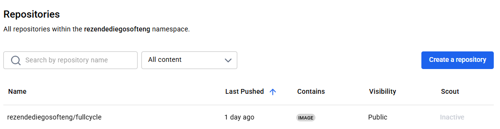

# Desafio Fullcycle - Go

Imagem publicada no Docker Hub:  
https://hub.docker.com/repository/docker/rezendediegosofteng/fullcycle/general

Para testar, execute:

```
docker run rezendediegosofteng/fullcycle
```

### Dockerhub

